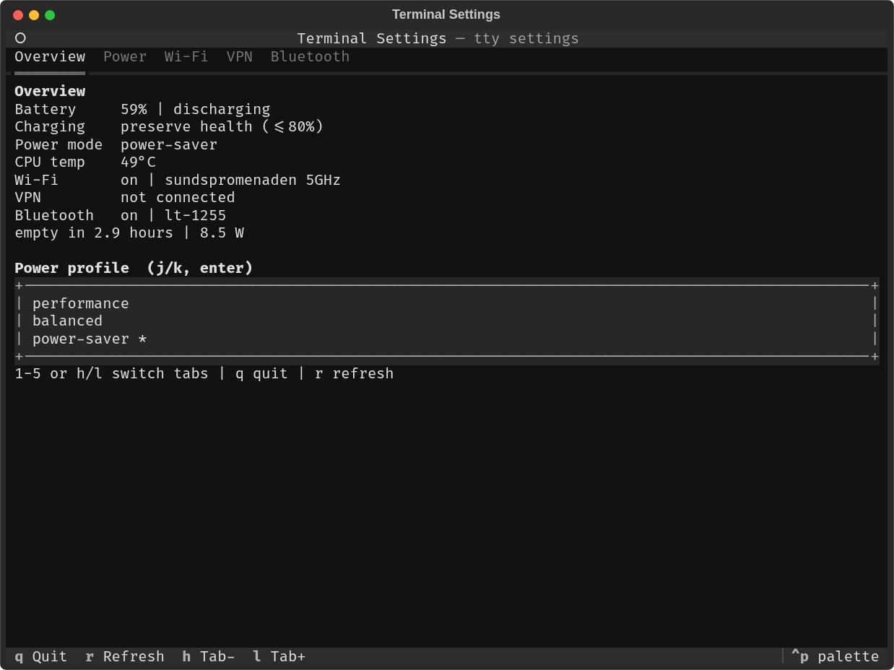

# Terminal Settings

Small Textual TUI for common system settings on Linux (NetworkManager + power-profiles-daemon + BlueZ).



## Install

Host tools (Debian/Ubuntu):

```bash
sudo apt install network-manager bluez power-profiles-daemon upower network-manager-openvpn
```

Download the latest Linux x86_64 binary from [Releases](https://github.com/gustafbrostrom/terminal-settings/releases):

```bash
chmod +x terminal-settings-*-linux-x86_64
./terminal-settings-*-linux-x86_64
```

Or run from source:

```bash
uv sync
uv run terminal-settings
```

## Features

- Battery status, CPU temperature, and power profiles (power-saver / balanced / performance)
- Battery charging mode (maximize charge / preserve battery health via UPower)
- Sleep, hibernate, lock, reboot, shut down
- Wi-Fi scan / connect / disconnect / radio toggle
- VPN / WireGuard connect / disconnect / import (`.ovpn`, `.conf`)
- Bluetooth scan / pair / connect / disconnect / power toggle

WireGuard VPN is built into NetworkManager. Charge limit UI appears only when the hardware reports UPower charge thresholds.
